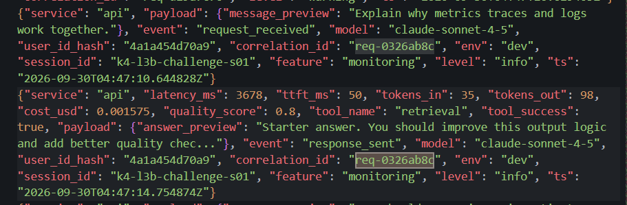
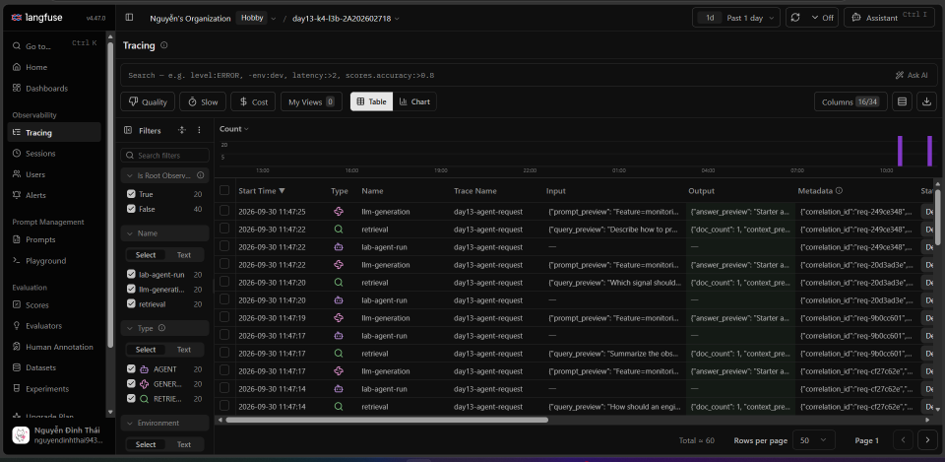
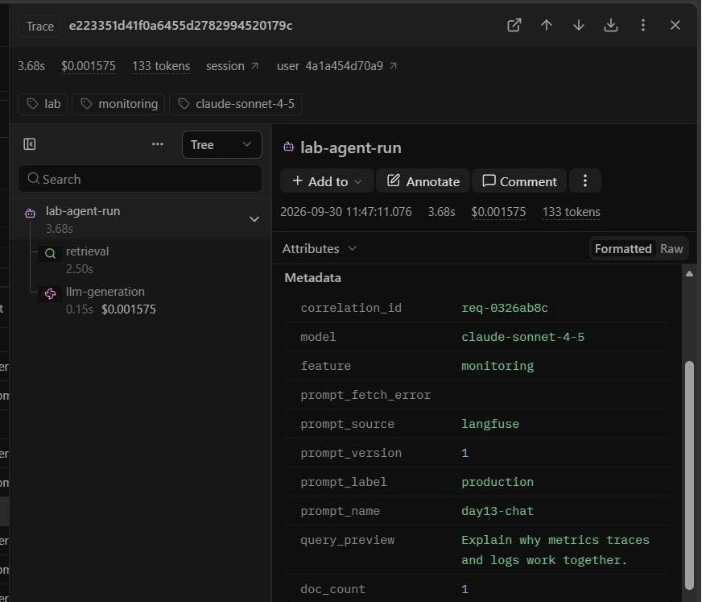
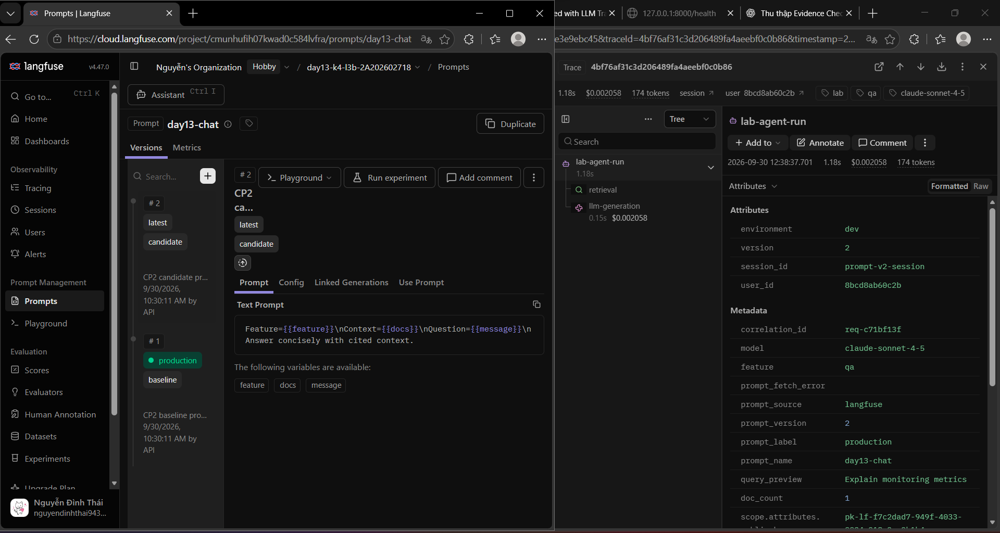
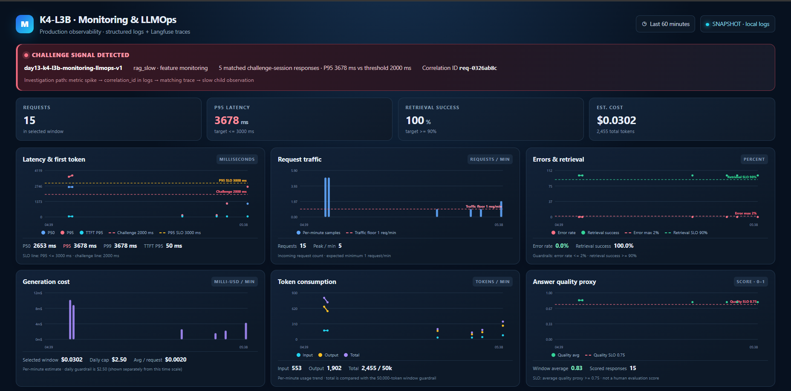

# Báo cáo cá nhân — K4-L3B Day 13 Monitoring & LLMOps

> Mỗi học viên hoàn thiện một file duy nhất này. Chỉ cần 3 output text và 5 ảnh runtime; dùng đường dẫn tương đối, ví dụ `evidence/03-incident-trace.png`.

## 1. Thông tin học viên

- **Họ và tên:** Nguyễn Đình Thái
- **MSSV:** 2A202602718
- **Lớp:** K4-L3B
- **Repository URL:** https://github.com/chocolinho/K4-L3-DAY13-NguyenDinhThai-2A202602718-Monitoring-LLMOps
- **Commit SHA cuối:** lấy bằng `git rev-parse HEAD` sau khi hoàn tất commit cuối và nộp đúng SHA đó trên LMS/Codelabs.
- **Challenge ID:** `day13-k4-l3b-monitoring-llmops-v1`
- **Tên project Langfuse cá nhân:** `day13-k4-l3b-2A202602718`

## 2. Evidence index

Giữ đúng ba output text và năm ảnh dưới đây. Không tách thêm ảnh; nếu cần giải thích, ghi bằng chữ trong các mục sau.

| Evidence | Đường dẫn |
|---|---|
| Pytest cuối | [evidence/pytest.txt](evidence/pytest.txt) |
| Log validator | [evidence/log-validator.txt](evidence/log-validator.txt) |
| Dashboard validator | [evidence/dashboard-validator.txt](evidence/dashboard-validator.txt) |
| Structured log + incident log | [evidence/01-incident-log.png](evidence/01-incident-log.png) |
| Trace list | [evidence/02-trace-list.png](evidence/02-trace-list.png) |
| Trace waterfall + metadata + incident trace | [evidence/03-incident-trace.png](evidence/03-incident-trace.png) |
| Prompt versions + promote/rollback | [evidence/04-prompt-versioning.png](evidence/04-prompt-versioning.png) |
| Dashboard + incident metric | [evidence/05-dashboard-incident.png](evidence/05-dashboard-incident.png) |

### Năm ảnh runtime

## 3. Kết quả kỹ thuật

| Nội dung | Baseline | Kết quả cuối | Nhận xét |
|---|---|---|---|
| `validate_logs.py` | 30/100 | 100/100 | CP1 đạt đủ required fields, correlation ID, enrichment và PII scrubbing |
| `validate_dashboard.py` | 6/6 | 6/6 | Dashboard contract giữ đúng sáu panel |
| `pytest` | 22 passed | 25 passed | Bổ sung test CP1 và child observations CP2 |
| Số traces hợp lệ | Chưa có CP2 | 10 request workload đã gửi | Xác nhận số trace hiển thị trong evidence Langfuse `02` |
| Số PII leak | 0 | 0 | Log validator và runtime redaction đều không phát hiện PII |
| Latency P95 / TTFT P95 | 1041 ms / 50 ms | CP3 latest batch: 3678 ms / 50 ms | Baseline trước CP3; challenge dùng batch CP3 mới nhất gồm 5 request |
| Retrieval success rate | — | 100% | `tool_success=true` trên các response hiện có |

## 4. Logging và PII

- **Cách tạo/nhận và truyền correlation ID:** [middleware](../app/middleware.py) xóa context cũ, nhận `x-request-id` hoặc sinh `req-<8-hex>`, bind vào structlog context, trả lại qua `x-request-id` và response body.
- **Các metadata được ghi vào structured log:** [API handler](../app/main.py) ghi `user_id_hash`, `session_id`, `feature`, `model`, `env`, cùng timestamp, event, latency, TTFT, token, cost và `correlation_id`.
- **Cách bảo đảm PII được scrub trước khi ghi:** [logging config](../app/logging_config.py) chạy `scrub_event` trước JSONL writer và JSON renderer; [PII rules](../app/pii.py) scrub đệ quy strings gồm email, phone VN, CCCD và credit card.
- **Cách kiểm chứng kết quả:** lần chạy hiện tại của `validate_logs.py` đạt 100/100 trên 172 record; 80 correlation ID duy nhất, 0 record thiếu enrichment và 0 PII leak. Pytest hiện tại đạt 25 passed.

## 5. Tracing và prompt versioning

- **Cách xác nhận traces do chính tôi tạo trong project cá nhân:** dùng key của project cá nhân trong `.env`, restart API sau khi đổi key và chạy workload 10 request không chứa PII; chụp danh sách trace trong project đó tại `evidence/02-trace-list.png`.
- **Cấu trúc root/retrieval/generation observations:** root `lab-agent-run` chứa child `retrieval` loại `retriever` và `llm-generation` loại `generation`; generation ghi model, input/output tokens và cost.
- **Cách nối trace với log:** `correlation_id` được bind trong middleware, truyền vào `propagate_attributes(metadata=...)` và xuất hiện trong structured log.
- **Prompt name:** `day13-chat`.
- **Version/label baseline:** version 1, labels `baseline` và `production`.
- **Version/label candidate:** version 2, label `candidate`.
- **Trace ID của mỗi version:** v1 / `production` — `e223351d41f0a6455d2782994520179c` (incident trace, ảnh 03); v2 / `production` trước rollback — `4bf76af31c3d206489fa4aeebf0c0b86` (ảnh 04, correlation `req-c71bf13f`). Hai ID đọc từ trace evidence trong project Langfuse cá nhân.
- **Cách promote và rollback `production`:** promote bằng cách chuyển label `production` sang version 2; rollback bằng cách chuyển label `production` về version 1. Lưu ảnh trước/sau trong ảnh `04-prompt-versioning.png`.

## 6. Dashboard, SLO và alerts

- **Dashboard và sáu panel:** [dashboard generator](../scripts/dashboard.py) đọc log runtime cục bộ, xuất `data/dashboard.html` gồm latency/TTFT, traffic, errors/retrieval success, cost, tokens và quality. Các chart hiển thị đơn vị, time range, ngưỡng challenge 2000 ms, latency SLO 3000 ms và retrieval/error guardrail; daily cost cap/window token cap được ghi ở summary cùng đúng phạm vi. Banner incident chỉ lấy batch challenge mới nhất và nối P95 với `correlation_id`. [Dashboard contract](../config/dashboard.yaml) đạt 6/6. Tạo lại bằng `python scripts/dashboard.py --input data/logs.jsonl --output data/dashboard.html --minutes 60`.
- **SLO và lý do chọn:** [config/slo.yaml](../config/slo.yaml) đặt mục tiêu 99.5% request thành công với latency <= 3000 ms trong cửa sổ 28 ngày, phù hợp mục tiêu phản hồi nhanh nhưng cho phép một lượng lỗi nhỏ.
- **Cách tính error budget:** `100% - 99.5% = 0.5%`; với 10,000 request, tối đa 50 request được phép không đạt SLO.
- **Ba alert và runbook tương ứng:** [alert_rules.yaml](../config/alert_rules.yaml) định nghĩa `high_latency_p95` (warning, 5m), `elevated_error_rate` (critical, 3m) và `low_retrieval_success` (warning, 5m), đều gửi Slack `#k4-l3b-alerts`; runbook tại [docs/alerts.md](../docs/alerts.md).

> Ví dụ cách viết error budget: "SLO 99.5% trong 28 ngày nghĩa là error budget 0.5%. Nếu workload có 10,000 request thì tối đa 50 request được phép lỗi hoặc chậm hơn ngưỡng SLO."

## 7. Điều tra challenge

- **Challenge ID:** `day13-k4-l3b-monitoring-llmops-v1` (cohort K4; theo [challenge config](../config/challenge.json))
- **Khoảng thời gian điều tra:** `2026-09-30T04:47:10Z`–`2026-09-30T04:47:25Z`
- **Triệu chứng từ metrics:** 5 request thuộc feature `monitoring`; P95 latency `3678 ms`, vượt threshold challenge `2000 ms`; TTFT P95 `50 ms`; retrieval success `100%`.
- **Log line và correlation ID liên quan:** `response_sent` có `correlation_id=req-0326ab8c`, `latency_ms=3678`, `tool_success=true`; các request còn lại gồm `req-cf27c62e`, `req-9b0cc601`, `req-20d3ad3e`, `req-249ce348`.
- **Trace ID và span gây ảnh hưởng:** trace `e223351d41f0a6455d2782994520179c`, cùng `correlation_id=req-0326ab8c`; span gây ảnh hưởng là child `retrieval` (2.50 s), trong khi generation khoảng 0.15 s.
- **Root cause:** practice challenge bật incident `rag_slow`, làm retrieval chậm; generation/TTFT không phải bottleneck chính.
- **Fix action:** tắt incident bằng `python scripts/inject_incident.py --disable` sau khi thu evidence và xác nhận latency trở lại baseline.
- **Preventive measure:** giữ alert `high_latency_p95`, lọc log bằng `correlation_id`, mở trace để phân biệt retrieval với generation và rollback cấu hình/prompt khi có regression.

> Gợi ý cách viết ngắn, không thay cho evidence thực tế: "Metric cho thấy `[latency/error/cost/quality]` bất thường trong `[khoảng thời gian]`. Log line `[event]` có `correlation_id=[...]` đại diện cho request bị ảnh hưởng. Trace cùng `correlation_id` cho thấy span `[retrieval/generation/prompt/tool]` có dấu hiệu `[chậm/lỗi/token tăng]`. Root cause là `[nguyên nhân suy ra từ evidence]`. Fix action là `[hành động khôi phục]`; preventive measure là `[alert/runbook/test/guardrail để ngăn tái diễn]`."

## 8. Giải thích và tự đánh giá

- **Một quyết định kỹ thuật quan trọng và lý do:** dùng observation context manager của Langfuse v4 để tạo child span, đồng thời có fallback no-op để test/local mode không cần credential.
- **Một lỗi/blocker đã gặp:** `LANGFUSE_BASE_URL` cũ trỏ tới hostname không phân giải được và prompt `production` chưa tồn tại.
- **Cách tìm nguyên nhân và xử lý:** kiểm tra kết nối HTTPS, đổi URL về `https://cloud.langfuse.com`, tạo prompt version 1/2 và xác nhận `PROMPT_FALLBACK=False`.
- **Cách hiểu luồng Metrics → Logs → Traces:** metrics khoanh vùng triệu chứng; log chọn request bằng `correlation_id`; trace xác định retrieval hoặc generation gây chậm/lỗi.
- **Vai trò của prompt version, token/cost, SLO hoặc rollback trong vận hành LLM:** prompt version giúp truy nguyên thay đổi; token/cost đo chi phí; SLO định nghĩa mức chấp nhận; rollback giảm tác động khi version mới gây regression.
- **Điều quan trọng nhất đã học:** log và trace phải dùng chung correlation ID nhưng vẫn là hai nguồn evidence khác nhau.
- **Hạn chế hoặc phần chưa hoàn thành, nếu có:** không còn blocker kỹ thuật đã biết. Bộ ảnh 03/05 hiện tại đã được chụp lại trực tiếp, không hiển thị public key và có time range cùng đủ sáu panel. SHA cuối được lấy sau khi commit bằng `git rev-parse HEAD` và nộp trên LMS/Codelabs.

## 9. Checklist trước khi nộp

- [x] Kết quả và evidence được đưa vào commit cuối của repository.
- [x] Tất cả ảnh/output được dẫn bằng đường dẫn tương đối.
- [x] Có đúng 3 file text và 5 ảnh runtime theo hướng dẫn.
- [x] Incident evidence nối đúng metric → log → trace.
- [x] Trace/prompt evidence thuộc project Langfuse cá nhân và ảnh hiện tại không lộ key/secret.
- [x] Repository chạy lại được theo README; pytest và hai validator đều đạt.
- [x] Không có secret, API key, PII thô hoặc evidence của người khác/lớp khác trong các artifact được commit.
- [ ] URL repo và commit SHA cuối đã được nộp trên LMS/Codelabs.
